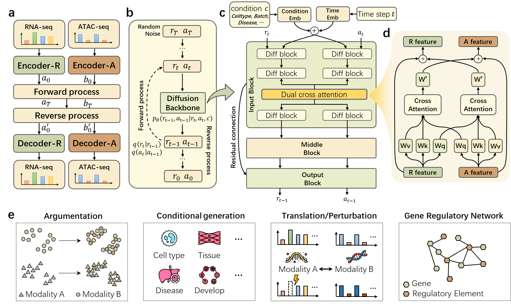

## scMulDiffusion: Diffusion Model for Single-Cell Multiome Data Generation and Analysis

Welcome! This is the official implement of scMulDiffusion.

TODO: introduction to scMulDiffusion
<!--  -->
<div align="center">  
      
</div>  

# User guidance

**Step1: Train the Autoencoder**
```
cd Autoencoder
bash train_autoencoder_multimodal.sbatch
```
Adjust the data path to your local path. The checkpoint will be saved in Autoencoder/project_folder/experiments and the log file will be saved in Autoencoder/project_folder/celldreamer. The `norm_type` in the encoder config yaml control the normalization type. For data generation task, we recommend batch_norm, and for translation task, we recommend layer_norm since it has better generalization for OOD data.

TODO: Explain the samll/norm/large and covariate_keys

**Step2: Train the Diffusion Backbone**

```
cd DiffusionBackbone
sh ssh_scripts/multimodal_train.sh
```
Again, adjust the data path and output path to your own, and also change the ae_path to the autoencoder you tarined in step 1. When training with condition (like the cell type condition), set the `num_class` to the number of unique labels. The training is unconditional when the `num_class` is not set.

TODO: Explain more about each attribution

**Step3: Generate new data**

```
cd DiffusionBackbone
sh ssh_scripts/multimodal_sample.sh
```
Change the MULTIMODAL_MODEL_PATH to the checkpoint path in step 2, and the DATA_DIR to your local data path.

The experiments results in the paper can be reproduce through `evaluate_script/inference_multi_diff.ipynb`

TODO: More details about the hyperpara, conditional and unconditional

**Founction: Modality translation**

For this task, we recommend you use `layer_norm` instead of `batch_norm` since it fit more for the OOD data. And if your source modality doesn't have a condition label overlap with the training data (like a external dataset), you can use unconditional training to train the model. If so, use a clustering method like leiden to get the cluster label as the covariate_keys for encoder (to get the size factor).
```
cd DiffusionBackbone
sh ssh_scripts/multimodal_train_translation.sh
sh ssh_scripts/multimodal_translation.sh
```
You need to change the file path in both bash file to your local path. The `GEN_MODE` is the target modality (either "rna" or "atac" for current model)

The experiments results in the paper can be reproduce through `evaluate_script/translation_multi_diff.ipynb`

TODO: change the format of input data file. More explaination about the hyperparameters.

**Founction: Gene-Peak regulatory analysis**

You need to first complete the step1 and step2. The detail implement can be found in ``evaluate_script/regulatory_multi_diff.ipynb``

<!-- Acknowledge: the code of this project is based on CFGen:https://github.com/theislab/CFGen and MM-diffusion: https://github.com/researchmm/MM-Diffusion. -->