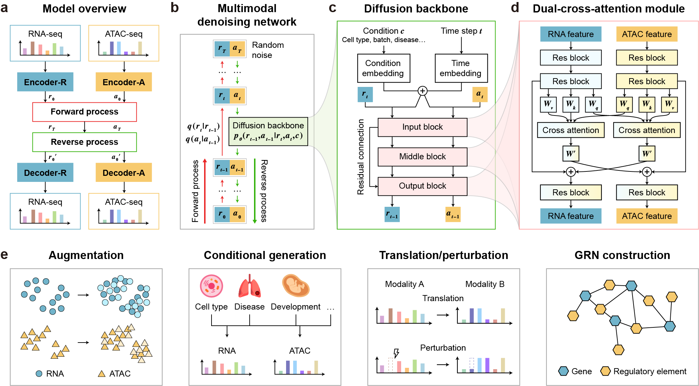

scDiffusion-X is a multi-modal latent denoising diffusion probability model for single-cell multi-omics data generation and integration. The model consists of two main components: a multimodal autoencoder and a multimodal denoising network. The multimodal autoencoder encodes each modality from the multi-omics data into a low-dimensional latent space, facilitating diffusion-based learning, and subsequently decodes it back to its original space (Figure a). The multimodal denoising network operates in latent space, progressively refining noisy representations to recover biologically meaningful multi-omics data (Figure b-c).

scDiffusion-X model can be applied to multiple downstream tasks (Figure e), including multi-omics data argumentation, multi-omics data conditional generation, modality translation and perturbation, and gene regulatory network inference. By integrating the power of diffusion models, cross-attention mechanisms, and condition-aware learning, scDiffusion-X offers a novel and interpretable framework for generating and analyzing single-cell multi-omics data, providing new insights into cellular heterogeneity and regulatory interactions.
